# ATHLEAP

This is a project made by [Kevin Joshi](https://github.com/KevinJ-hub) & [Kaushal Binjola](https://github.com/KaushalBinjola).  
It is hosted on [Heroku](https://www.heroku.com), you can check it out [here](https://athleap.herokuapp.com). Database used is MongoDB which is hosted on [MongoDB Atlas](https://www.mongodb.com/atlas/database) and various dependencies like [PHPMailer](https://github.com/PHPMailer/PHPMailer) ✉️ & [Confetti JS](https://github.com/Agezao/confetti-js) 🎊 have been used.  
It is a **Php based web app** that can help you **track the amount of calories you have burnt** 🔥 in majorly three types of fitness activities which are Gym 🏋️, Yoga 🧘 and Running 🏃. You will also be awarded with FCoins 🪙 (Fitness Coins) based on your performance which then can be used to claim prizes 🎁 from the shop.  

> **NOTE:** Since the app is hosted for free on heroku it goes to sleep on 30 mins of inactivity so there might be a possibility that the app takes a few seconds to load INITIALLY so please be patient.  

## Tech Used

- PHP
- Mongodb
- HTML
- CSS
- JS
- Bootstrap
- Font Awesome

## Running this project

You can head over to [https://athleap.herokuapp.com](https://athleap.herokuapp.com) to try out the app in your browser.  

OR  

1. Clone this repository in your apache server's directory
2. Run the following command in the root of the project

```sh
$ composer install
```

3. Add key "ATLAS_CREDENTIALS" in the environment variables to contain the value as the mongodb connection string
4. Add key "EMAIL_USERNAME" and "EMAIL_PASSWORD" in the environment variables to contain the value as your Email Id and Password from which the mails will be sent

## Images

### Desktop

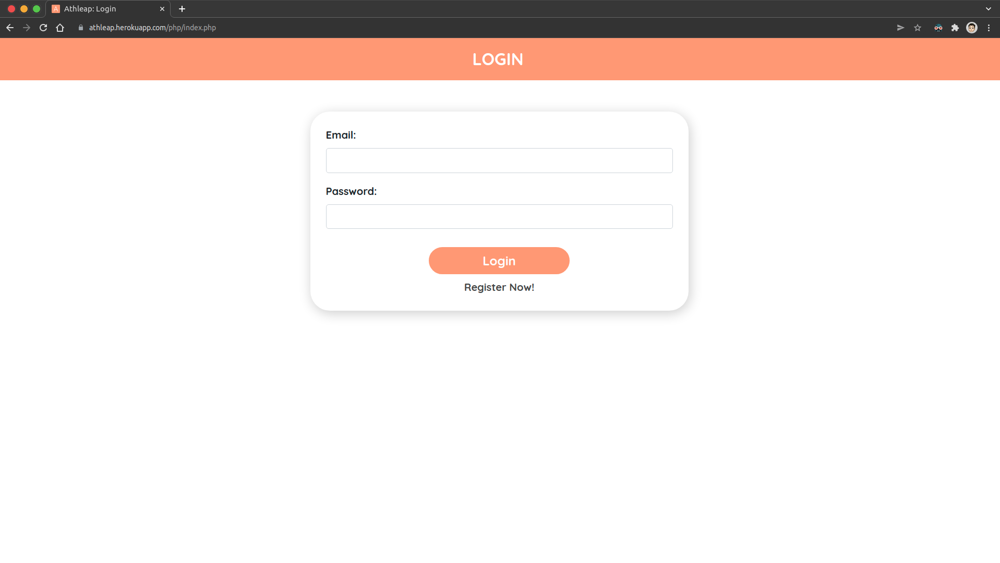
---
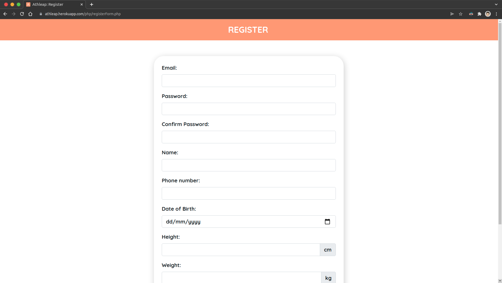
---
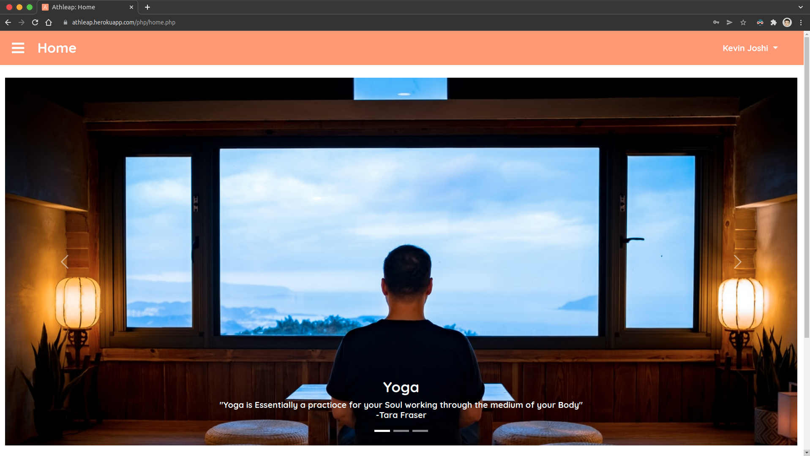
---
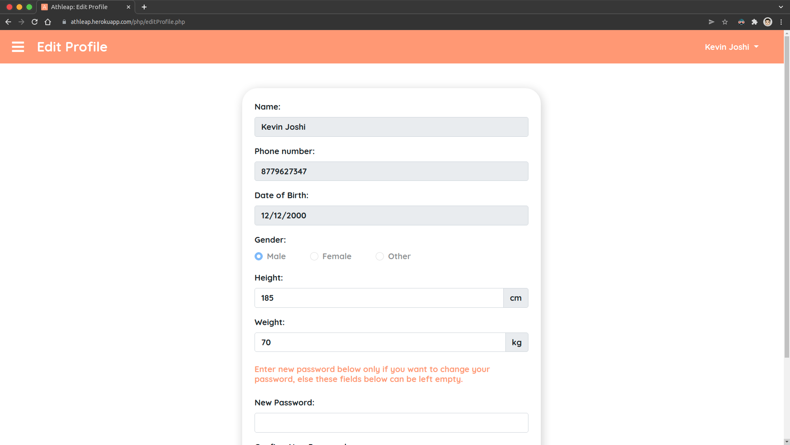
---
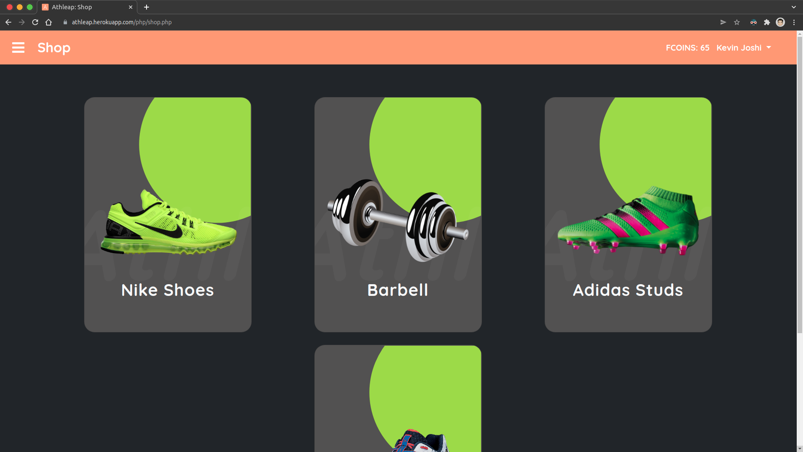
---
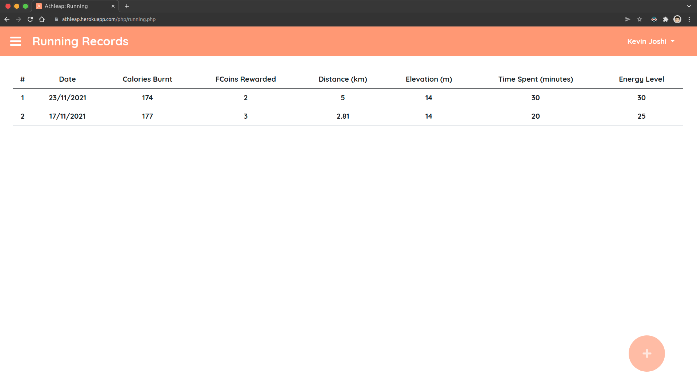
---
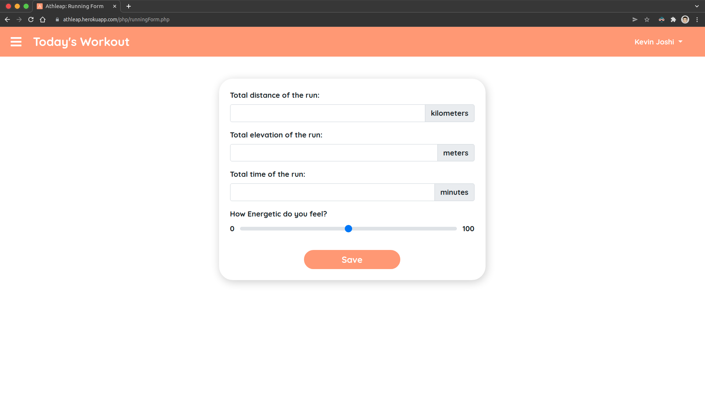
---
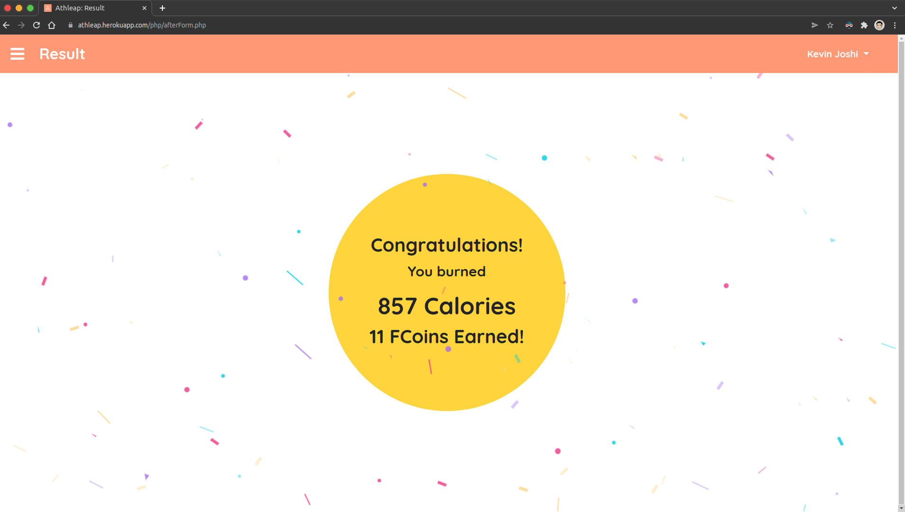


### Mobile Devices

| 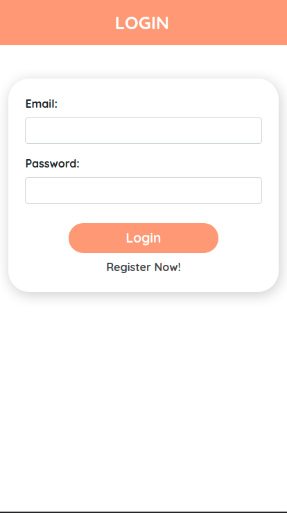 | 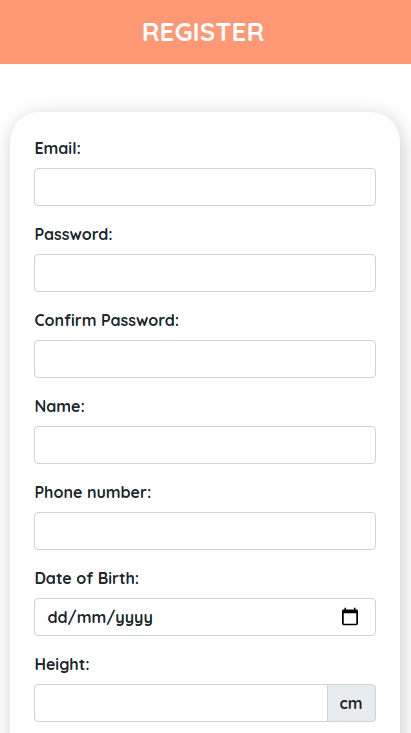 | 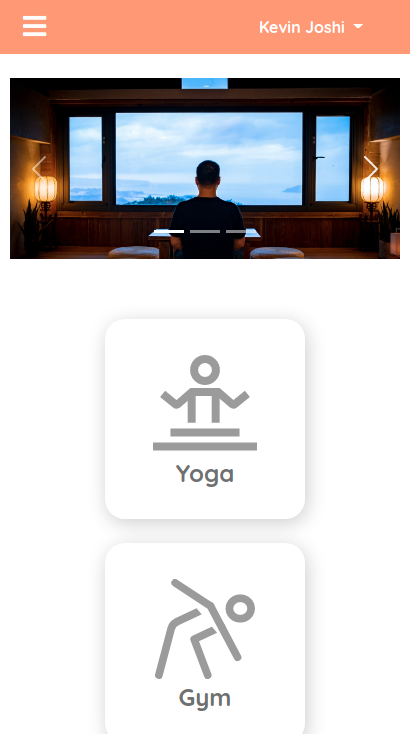 | 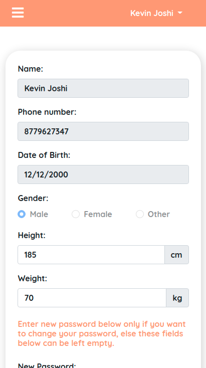 |
|---|---|---|---|
| 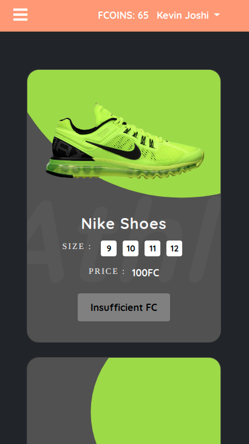 | 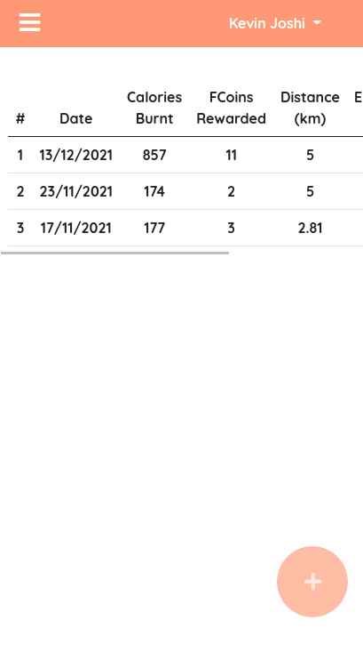 | 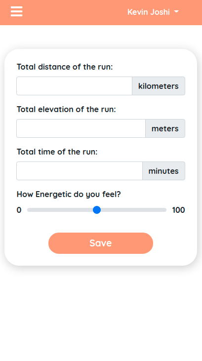 | 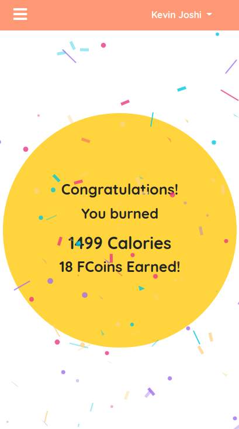 |
